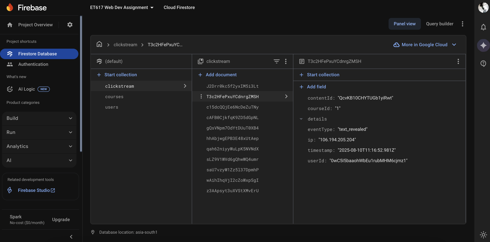

# Educational-Website-Deployed-With-Clickstream-Tracking

A (sample) learning website hosted on **Google Firebase** and built with **React** (create-react-app) that tracks and stores clickstream data of user interactions.  
This project is an individual assignment for **ET617 — Educational App Design, Fall 2025, IIT Bombay**.

**My Live Demo:** https://et617-web-dev-assignment.web.app/

**Demo Video:** See 'Demo Video.mov' or on [Google Drive](https://drive.google.com/file/d/1ViTejBTlF1eX_zUZOyDYEgnYnTIFlSr0/view?usp=sharing).

## Features

- Firebase Authentication (email/password or other providers)
- Per-user course registration (Firestore)
- Course content types (unlock-on-click):
  - Text lessons
  - YouTube videos (used `react-youtube` for this)
  - Quizzes
- Clickstream tracking for user interactions:
  - dashboard view clicks (`dashboard_view_course_click`)
  - course open (`view_course`)
  - content reveal (`text_revealed`, `video_revealed`, `quiz_revealed`)
  - video events (`video_play`, `video_pause`, `video_ended`)
  - quiz submit (`quiz_submit`)
- Clickstream stored in Firestore for later analysis

## Tech stack

- `React` (create-react-app)
- `Firebase` (Auth, Firestore, Hosting)

Installed packages:
    `react` `react-dom` `react-router-dom` `react-youtube` `firebase` `firebase-tools` `react-firebase-hooks`

## Firestore structure

Courses collection: 
&emsp;courses (collection) 
&emsp;└── {courseId} (document) 
&emsp;&emsp;&emsp;&emsp;&emsp;title: string 
&emsp;&emsp;&emsp;&emsp;&emsp;description: string 
&emsp;&emsp;&emsp;&emsp;&emsp;contents (subcollection) 
&emsp;&emsp;&emsp;&emsp;&emsp;└── {contentId} (document) 
&emsp;&emsp;&emsp;&emsp;&emsp;&emsp;&emsp;&emsp;&emsp;type: "text" | "video" | "quiz" 
&emsp;&emsp;&emsp;&emsp;&emsp;&emsp;&emsp;&emsp;&emsp;order: number 
&emsp;&emsp;&emsp;&emsp;&emsp;&emsp;&emsp;&emsp;&emsp;data: { ... }      // content data: data.title, data.text, data.YouTubeVideoID, data.questions, etc. 

Users collection: 
&emsp;users (collection) 
&emsp;└── {userId} (document) 
&emsp;&emsp;&emsp;&emsp;&emsp;registeredCourses: [ "react-basics", "advanced-js", ... ] 
&emsp;&emsp;&emsp;&emsp;&emsp;// other user metadata

Clickstream collection (global example): 
&emsp;clickstream (collection) 
&emsp;└── {eventId} (document) 
&emsp;&emsp;&emsp;&emsp;&emsp;userId: string 
&emsp;&emsp;&emsp;&emsp;&emsp;eventType: string 
&emsp;&emsp;&emsp;&emsp;&emsp;courseId?: string 
&emsp;&emsp;&emsp;&emsp;&emsp;contentId?: string 
&emsp;&emsp;&emsp;&emsp;&emsp;timestamp: Firestore serverTimestamp 
&emsp;&emsp;&emsp;&emsp;&emsp;ip?: string 
&emsp;&emsp;&emsp;&emsp;&emsp;details?: object

## Example clickstream screenshot

## Local setup (development)

1. Clone repository:
    git clone <repo-url>
    cd Educational-Website-Deployed-With-Clickstream-Tracking/react-files

2. Install dependencies:
    npm install

3. Create a Firebase project in the Firebase Console and enable:
   - Authentication
   - Firestore (in test mode during development)
   - Hosting (for deployment)

4. Add Firebase config: create `src/firebase.js`:

    import { initializeApp } from "firebase/app";
    import { getAuth } from "firebase/auth";
    import { getFirestore } from "firebase/firestore";

    const firebaseConfig = {
      apiKey: "YOUR_API_KEY",
      authDomain: "YOUR_AUTH_DOMAIN",
      projectId: "YOUR_PROJECT_ID",
      storageBucket: "YOUR_STORAGE_BUCKET",
      messagingSenderId: "YOUR_MESSAGING_SENDER_ID",
      appId: "YOUR_APP_ID"
    };

    const app = initializeApp(firebaseConfig);
    export const auth = getAuth(app);
    export const db = getFirestore(app);
    export default app;

5. Start dev server:
    npm start

Open http://localhost:3000

## How clickstream logging works

- A central `logEvent(userId, event)` utility writes clickstream events to Firestore.
- Event payload example:
    {
      userId: "uid_ABC",
      eventType: "video_play",
      courseId: "react-basics",
      contentId: "002-video-jsx",
      timestamp: serverTimestamp(),
      ip: "203.0.113.45",       // optional, if collected
      details: { position: 12 } // optional metadata
    }
- Where to call `logEvent`:
  - Dashboard click → before navigating to course page
  - Course page load → log `view_course`
  - Content reveal → `*_revealed`
  - Video/quiz interactions → respective events

### IP collection
- Browser-side IP fetch (public API like https://api.ipify.org) is possible but unreliable and may be blocked by privacy settings.

## License & credits

Student assignment for ET617 — Educational App Design (IIT Bombay).  
Not intended for production. Feel free to reuse for learning and experiments.